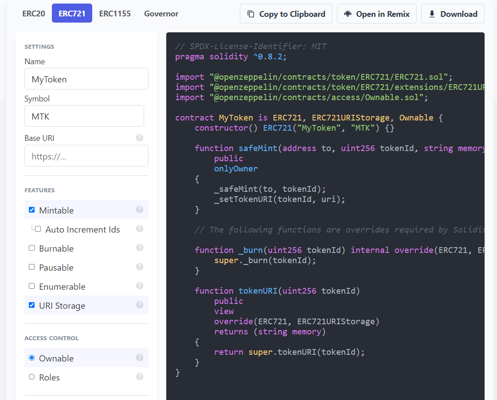
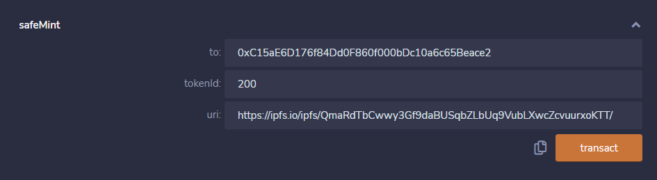
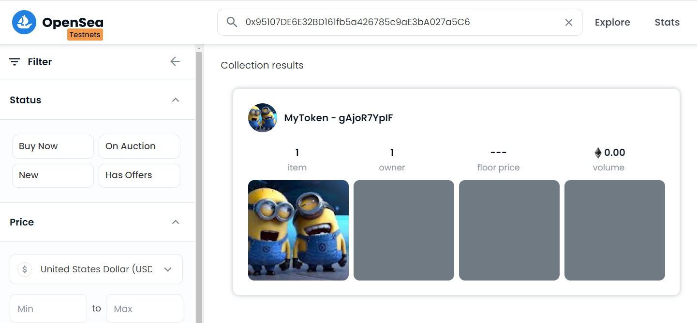

# ERC721 NFT 練習

# 產生 IPFS 檔案

- 從 [https://ipfs.io/](https://ipfs.io/)  下載並安裝
- 上傳圖片，取得CID: 匯入圖案後，按圖片右邊  ...  圖示，選擇 複製CID


- 將JSON檔填入圖片的IPFS位置，格式可參考網路其它人的格式，image 項目的內容填入圖片的IPFS，格式為 ipfs://*{圖片CID}*/   ，例如圖片CID為 QmWnJdQXL6iMP8esKXNk5xYxWS2tD6bYiwnoH6F7oZsXvu ，IPFS 的 URI 為 ipfs://QmWnJdQXL6iMP8esKXNk5xYxWS2tD6bYiwnoH6F7oZsXvu/

```
{
	"description": "Our first NFT.",
	"image": "ipfs://QmWnJdQXL6iMP8esKXNk5xYxWS2tD6bYiwnoH6F7oZsXvu/",
	"attributes": [
		{
			"trait_type": "Eyes",
			"value": "Angry"
		},
		{
			"trait_type": "Fur",
			"value": "Cream"
		},
		{
			"trait_type": "Background",
			"value": "Blue"
		},
		{
			"trait_type": "Hat",
			"value": "Horns"
		},
		{
			"trait_type": "Clothes",
			"value": "Kings Robe"
		},
		{
			"trait_type": "Mouth",
			"value": "Phoneme Oh"
		}
	]
}
```

- 將 json 檔案匯入至IPFS，按 json 檔案右邊  ...  圖示，選擇 複製CID


- 取得 json 的CID 後，組成要填入 ERC 721 的 metadata URI，格式為 https://ipfs.io/ipfs/*{json CID}*/   ，例如 json CID 為 QmaRdTbCwwy3Gf9daBUSqbZLbUq9VubLXwcZcvuurxoKTT ，metadata URI 為 https://ipfs.io/ipfs/QmaRdTbCwwy3Gf9daBUSqbZLbUq9VubLXwcZcvuurxoKTT/

# 產生  ERC 721 合約

- 透過 OpenZeppelin **Contracts Wizard (**[https://wizard.openzeppelin.com/](https://wizard.openzeppelin.com/)) 產生 Contract ，選擇 ERC721項目，並勾選 Mintable及  URI Storage  項目，產生合約程式碼，複製到 Remix IDE



```
// SPDX-License-Identifier: MIT
pragma solidity ^0.8.2;

import "@openzeppelin/contracts/token/ERC721/ERC721.sol";
import "@openzeppelin/contracts/token/ERC721/extensions/ERC721URIStorage.sol";
import "@openzeppelin/contracts/access/Ownable.sol";

contract MyToken is ERC721, ERC721URIStorage, Ownable {
    constructor() ERC721("MyToken", "MTK") {}

    function safeMint(address to, uint256 tokenId, string memory uri)
        public
        onlyOwner
    {
        _safeMint(to, tokenId);
        _setTokenURI(tokenId, uri);
    }

    // The following functions are overrides required by Solidity.

    function _burn(uint256 tokenId) internal override(ERC721, ERC721URIStorage) {
        super._burn(tokenId);
    }

    function tokenURI(uint256 tokenId)
        public
        view
        override(ERC721, ERC721URIStorage)
        returns (string memory)
    {
        return super.tokenURI(tokenId);
    }
}
```

# 測試合約

在Remix IDE 中 Deploy Contract ，並呼叫 safeMint function，需填入的參數為

- to: Mint 的錢包地址
- tokenId: NFT 的 token 編號
- uri: metadata URI，填入 json 檔案的 URI



執行後可到 OpenSea Testnet ([https://testnets.opensea.io/](https://testnets.opensea.io/)) 依合約地址搜尋合約的NFT項目




- 若圖片沒有顯示的話，可以在NFT明細頁(上面的最後一張圖的畫面)，按右上角的 Refresh 按鈕更新圖片


# Rinkeby Etherscan 查看交易內容

在  [https://rinkeby.etherscan.io/](https://rinkeby.etherscan.io/) 輸入合約地址，查看 Transactions

